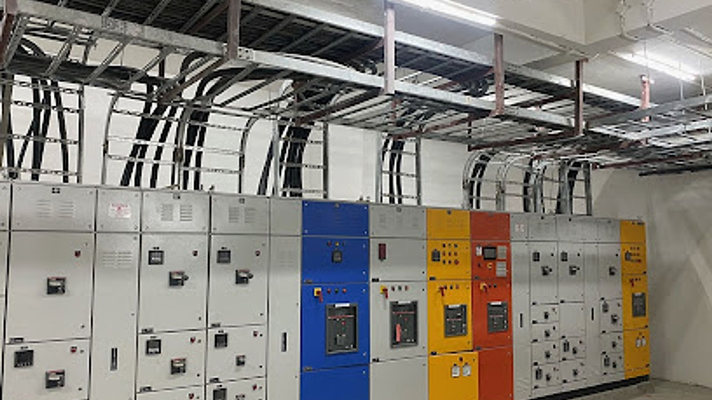

<div align="center">
  <br/>
  
  
  
  <br/><br/>

  <h1>⚡ SARTHI ELECTRICALS ⚡</h1>

  <h3>Professional Electrical Services in Gharaunda, Haryana</h3>

  <br/>

  <a href="https://github.com/Powerisvansh/SARTHI-ELECTRICALS">
    
  </a>
  <a href="https://github.com/Powerisvansh/SARTHI-ELECTRICALS/fork">
    
  </a>

  <br/><br/>

  <p>
    A modern, responsive business website built for <strong>SARTHI ELECTRICALS</strong> — trusted electrical engineering service providers. The site showcases services, client testimonials, and contact info with a clean, premium design.
  </p>

  <br/>

  <a href="https://powerisvansh.github.io/SARTHI-ELECTRICALS/" target="_blank">
    
  </a>

  <br/><br/>

  <a href="https://powerisvansh.github.io/SARTHI-ELECTRICALS/" target="_blank">
    
  </a>
</div>

---

## ✨ Features

| | Feature | Description |
|---|---|---|
| 📱 | **Responsive Design** | Fully adaptive — desktop, tablet, mobile |
| 🎬 | **Smooth Animations** | Scroll-triggered reveals + custom smooth scrolling |
| 🔢 | **Animated Counters** | Stats count up live on scroll |
| 🍔 | **Mobile Navigation** | Hamburger menu with smooth toggle |
| 📊 | **Scroll Progress Bar** | Visual indicator at page top |
| ⬆️ | **Back to Top** | Smooth scroll-to-top button |
| 📞 | **WhatsApp Float** | Quick-call button for mobile users |

---

## 🛠 Tech Stack

<div align="center">

  
  
  
  

</div>

- **HTML5** — Semantic, accessible markup
- **CSS3** — Custom properties, gradients, grid, flexbox, animations
- **JavaScript** — Intersection Observer, DOM manipulation, `requestAnimationFrame`
- **Node.js** — Simple dev server

---

## 📁 Project Structure

```
SARTHI-ELECTRICALS/
├── 📄 index.html           # Home page
├── 📄 services.html        # Services page
├── 📄 gallery.html         # Gallery page
├── 📄 about.html           # About us page
├── 📄 contact.html         # Contact page
├── 📁 css/
│   └── 🎨 style.css        # All styles
├── 📁 js/
│   └── ⚙️ main.js          # All scripts
├── 📁 images/              # Image assets
├── 📄 serve.js             # Dev server
├── 📄 package.json
└── 📄 README.md
```

---

## 🚀 Getting Started

```bash
# 1. Clone the repository
git clone https://github.com/Powerisvansh/SARTHI-ELECTRICALS.git

# 2. Navigate into the project
cd SARTHI-ELECTRICALS

# 3. Install dependencies
npm install

# 4. Start the dev server
npm start

# 5. Open http://localhost:3000 in your browser
```

> **Quick alternative** — Just open `index.html` directly in any browser. No build step needed.

---

## 🌐 Pages Overview

| Page | Description |
|---|---|
| [`index.html`](index.html) | Hero, stats, services preview, testimonials, CTA |
| [`services.html`](services.html) | Full list of electrical services offered |
| [`gallery.html`](gallery.html) | Project photo gallery |
| [`about.html`](about.html) | Company info, mission, values |
| [`contact.html`](contact.html) | Contact form, phone, address, hours |

---

## 📞 Contact

<div align="center">

**SARTHI ELECTRICALS**  
📍 Vill. Panouri, Tehsil Gharaunda, Gharaunda, Haryana 132114  
📞 [**092551 27777**](tel:09255127777)  
🕐 Open · Closes 8 PM

</div>

---

<div align="center">
  <sub>Built with ❤️ for SARTHI ELECTRICALS</sub>
  <br/><br/>
  <a href="https://github.com/Powerisvansh/SARTHI-ELECTRICALS">
    
  </a>
  <br/><br/>
  <strong>© 2026 SARTHI ELECTRICALS. All rights reserved.</strong>
</div>
